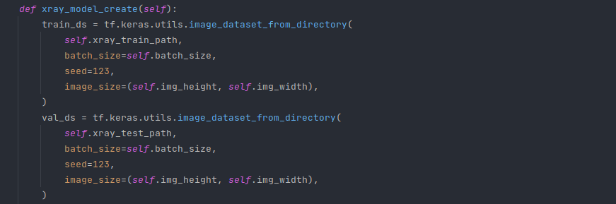

[](https://github.com/cyberty-liberty/RayTensor/actions/workflows/raytests.yml)
[](https://www.gnu.org/licenses/gpl-3.0)

[](https://github.com/psf/black)

[](https://git.io/typing-svg)

# Что это?

## RayTensor - рекомендательная система помощи формирования диагноза по данным рентгена и КТ на основе глубокого обучения

# Как это работает?

## Tensorflow в связке с Keras составляют основу приложения - нейронную сеть, определяющую 3 диагноза у рентген-снимков:
<ul>
<li><h3>1. Пневмония.</h3></li>
<li><h3>2. Ковидная пневмония (SARS-CoV-2)</h3></li>
<li><h3>3. Очаговый туберкулёз лёгких</h3></li>
</ul>

## 2 диагноза для КТ-снимков:
<ul>
<li><h3>1. Пневмония.</h3></li>
<li><h3>2. Ковидная пневмония (SARS-CoV-2)</h3></li>
</ul>

# Использование Tensorflow и Keras для создания нейронной сети:

## Импорт библиотек и инициализация проекта:

<p align="center">

</p>

## Создание тренировочного и валидационного датасета:

<p align="center">

</p>

## Архитектура нейронной сети:

<p align="center">

</p>

<p align="center">

</p>

## Точность определения диагноза составляет более 98%!

<p align="center">

</p>

<p align="center">

</p>

## Вершину айсберга составляет веб-сервер, написанный на микрофреймворке Flask.

<p align="center">

</p>

## Frontend основан на стандартном HTML5 с привязкой к стилям Bootstrap, а также на встроенном в Flask шаблонизаторе Jinja, обеспечивающий высокую читаемость кода за счёт сокращения его количества.

<p align="center">

</p>

## Помимо веб-версии программного комплекса доступен Telegram бот, облегчающий сканирование фотографий.

<p align="center">

</p>

<p align="center">

</p>

# Установка:

```shell
git clone https://github.com/AdvoCat007/RayTensor
cd RayTensor
pip install --upgrade pip
pip install -r requirements.txt
```

## Запуск web-сервера:

```shell
python3 rayweb.py
```

## Запуск Telegram-бота:

```shell
python3 raybot.py
```

# Использование web-приложения

## При развёртывании сервера нас встречает минималистичная главная страница с основными гиперссылками. Кроме того, Header может обеспечить Вам быстрое перемещение по сайту.

<p align="center">

</p>

## В зависимости от выбранного варианта, откроется шаблонизированная форма загрузки образца на сайт:

<p align="center">

</p>

## После выбора файла форма передаст файл модели для дальнейшей предобработки и анализа:

<p align="center">

</p>

## Долгожданный результат! На выходе сайт возвращает выгруженное Вами изображение, а также показывает поставленный диагноз и его вероятность.

<p align="center">

</p>

# Использование Telegram-бота

## 1. Запустите Telegram-бота командой:

```shell
python3 raybot.py
```

## 2. Перейдите по ссылке на Telegram-бота.

## [RayTensor Bot](http://t.me/raytensor_bot)

## 3. Нажмите START и следуйте инструкциям бота.

# Для всех вопросов:
## [Telegram](https://t.me/RightLiberty)
